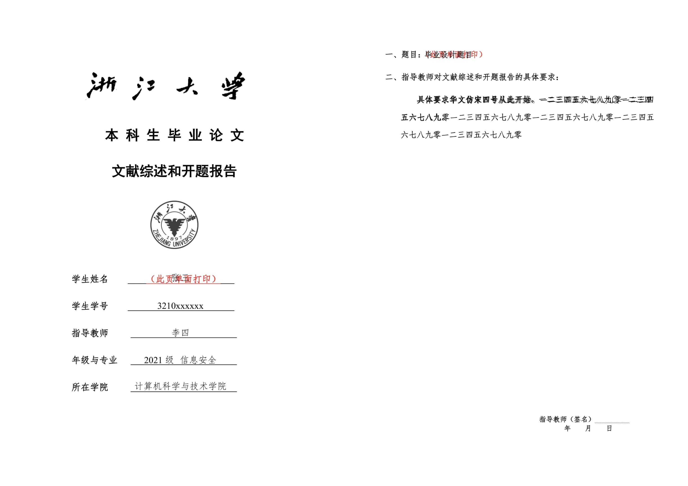

# CS-LaTeX-MidTerm

浙江大学计算机学院毕业论文文献综述和开题报告 LaTeX 模板。

使用本仓库编译出的文档与 Word 模板生成的文档对比（两个文件叠加显示）：



主题内容参考[信电学院本科生毕业论文（设计）中期检查报告LaTeX模板](https://github.com/SuperbRa1n/ISEE_LaTeX_Mid-term)，本仓库针对格式要求进行了一些改动，并作了一些简单的封装。

## 使用方法

1. 在 `main.tex` 中填写论文题目、作者等文档信息。
2. 在 `contents/requirement.tex` 中填写指导教师对文献综述和开题报告的具体要求。
3. 在 `contents/survey.tex` 中填写文献综述的内容。
    - 在 `reference/survey-refs.bib` 中填写文献综述的参考文献。
4. 在 `contents/report.tex` 中填写开题报告的内容。
    - 在 `reference/report-refs.bib` 中填写开题报告的参考文献。
5. 在 `contents/translation.tex` 中填写外文文献的翻译。
6. 在 `contents/original.tex` 中填写翻译前的原始外文文献。
7. 参考[下一节内容](#编译文档)编译文档。

## 编译文档

### 使用 VSCode 插件 LaTeX Workshop

本仓库配置了 LaTeX Workshop 插件的工作区配置，提供三个编译配方：

- `XeLaTeX`：使用 XeLaTeX 编译文档一次，这是默认的编译配方，在保存文档时自动触发。
- `xe-bib-xe-xe`：按照 XeLaTeX -> BibTeX -> XeLaTeX -> XeLaTeX 的顺序编译文档。这会完整生成参考文献和目录，适合最终生成 PDF。
- `Clean`：清理所有中间产物（仅限 Windows 系统）。

如果 `survey.tex` 或 `report.tex` 中没有引用任何参考文献，需要在文档中手动添加 `\nocite{*}` 以免参考文献为空导致 BibTeX 编译失败。这种情况下，也可以选择下面的[手动编译](#手动编译)方法。

如果想要修改保存文档时自动触发的编译行为，可以修改 `.vscode/settings.json` 文件中的 `latex-workshop.latex.recipe.default` 配置项。

### 手动编译

使用 xe-bib-xe-xe 的编译链编译文档：

```bash
xelatex main.tex
bibtex ./contents/survey
bibtex ./contents/report
xelatex main.tex
xelatex main.tex
```

如果在 `survey.tex` 或 `report.tex` 中没有引用参考文献，需要省略对应的 `bibtex` 命令。

### 使用 LaTexMK

编译文档：

```bash
latexmk
```

清理中间产物：

```bash
latexmk -c
```

清理中间产物和生成的 PDF：

```bash
latexmk -C
```

目前这种方法清理的中间产物无法清理掉 `contents` 目录下的 `.bbl` 和 `.blg` 文件，需要手动删除。